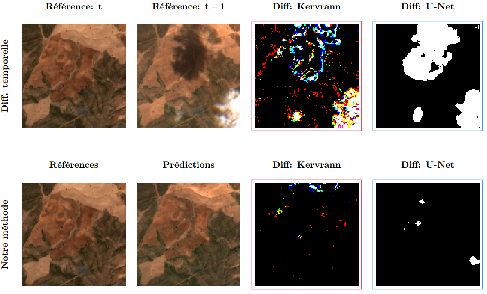
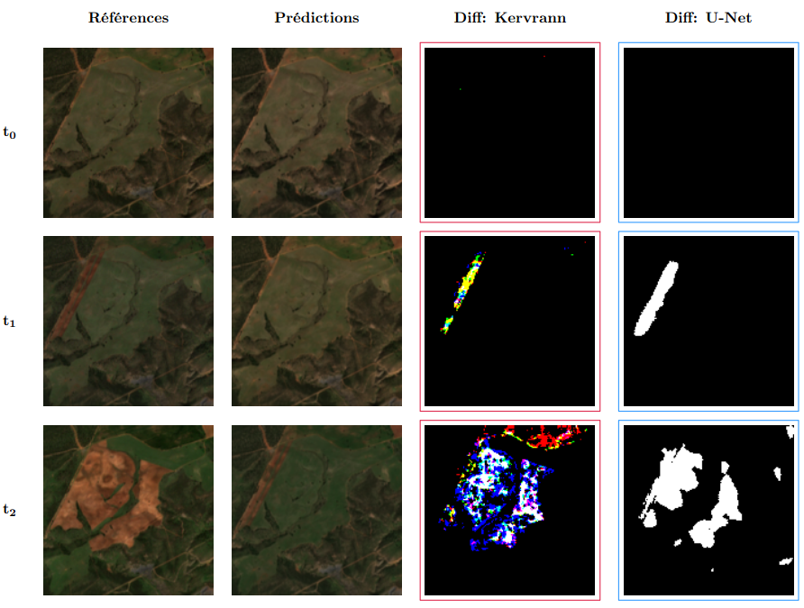

# Project 4: Predicting the future to detect changes

## Overview

Extracting reliable information from dense Sentinel-2 satellite image time series requires robust change detection methods capable of overcoming atmospheric noise, such as cloud cover. Standard methods comparing an image at time $t$ to time $t−1$ are highly sensitive to these non-relevant changes.

To solve this, this project replaces the target image with a predicted image. By using the TAMRFSITS Transformer-based framework, we predict a cloud-free estimation of the "present" based on a sliding window of past acquisitions. We then apply two distinct change detection algorithms (an extended multi-band Kervrann method and a Deep Learning U-Net) to compare this clean prediction against the actual acquisition.




## Project architecture
```
.
├── tamrfsits/*        # TAMRF model github repository
├── dataset/*          # Containing the training / test samples
├── model/*            # Containing the pre-trained TAMRFSITS model
├── notebooks/*.ipynb  # Experimental studies
├── src/*.py           # Code for results visualization
├── forecasting/*      # Contains all generated predictions + filters (.tif format)
├── .gitignore
└── README.md
```

## Datasets and Pre-trained Models

### 1. Training & test dataset

This project exclusively uses Sentinel-2 Level-2A products (Bottom-of-Atmosphere reflectance) across the 10 bands with the finest spatial resolutions (10m and 20m).

Download the primary dataset from Zenodo: [https://zenodo.org/records/15471890](https://zenodo.org/records/15471890)
* Unzip the archives inside the `dataset` folder.

We also provide supplementary data and results for our specific experiments:
* **Areas of interest dataset:** [Download via Google Drive](https://drive.google.com/file/d/1orINa26TiHzIFKxRn7wWXirG_KUbWBlI/view?usp=sharing)
* **Experiment results:** [Download via Google Drive](https://drive.google.com/file/d/1pYkQAMrfWw3NwoFVEDrVCtx0zRKHcQg8/view?usp=sharing)

### 2. Pre-trained model
The pre-trained TAMRFSITS model is available in the following Zenodo repository: [https://zenodo.org/records/15582231](https://zenodo.org/records/15582231)

> MICHEL, J. (2025). Support data for paper "Temporal Attention Multi-Resolution Fusion of Satellite Image Time-Series, applied to Landsat-8 and Sentinel-2: all bands, any time, at best spatial resolution" (2.0) [Data set]. Zenodo. [https://doi.org/10.5281/zenodo.17474541](https://doi.org/10.5281/zenodo.17474541)

* Unzip the archives inside the project root directory (`model` folder).


## Installation:
```sh
git clone https://github.com/RomainCrgnl/ProjetTAMRFSITS_RemoteSensingMVA.git
cd ProjetTAMRFSITS_RemoteSensingMVA
```
#### Download training/test data:
Download the dataset: https://zenodo.org/records/15471890

Unzip archives inside the "dataset" folder.


#### Download TAMRF model github repository and dependancies:

This project uses [pixi](https://pixi.sh) as package manager and project configuration tool. Install `pixi` like this for Linux:
```sh
curl -fsSL https://pixi.sh/install.sh | bash
```
or like this for Windows:
```sh
powershell -ExecutionPolicy Bypass -c "irm -useb https://pixi.sh/install.ps1 | iex"
```

Clone the `tamrfsits` sources like this:
```sh
git clone https://github.com/TopAgrume/tamrfsits.git
```

And use `pixi` to install the project and its dependencies:

```sh
cd tamrfsits
pixi install
pixi shell
```


---

## Usage & Inference

### Inference Parameters
The project introduces several new parameters to customize the inference and forecasting process. You can modify these in your configuration (or inside run_inference.sh):

| Parameter | Type | Description |
| :--- | :--- | :--- |
| `custom_forecast_context_size` | `int` | Number of images to keep in the context window (default: `5`). |
| `custom_forecast_gap_step` | `int` | Gap between context images (`1` = use all consecutive images, `2` = use one image out of two, etc.). |
| `custom_forecast_only_hr` | `bool` | Set to `True` to use only Sentinel-2 (High Res). Mixed Landsat / Sentinel-2 support is currently not supported. |
| `dt_orig` | `str` | Sets the "DOY 0" (Day of Year origin), default: `"2021-01-01"`. |
| `custom_forecast_sliding_window` | `bool` | Set to `True` to run predictions over the entire time series. |
| `custom_forecast_horizon` | `int` | The distance between the context window and the target prediction date. |
| `coordinates_of_interest` | `tuple` | Coordinates to center the object of interest in the image and predictions. This prevents the object from falling between four patches (in a rigid grid format) or into margin artifacts. |


### Running Model Inference
Once your environment is set up and your config is updated with the parameters above, you can run the inference script from the root directory:

```bash
# Make sure you are at the project root
./run_inference.sh
# Note: feel free to modify the config file referenced in this script before running.
```

---

## Change Detection Models

We provide two different methods for change detection on the forecasted images.

### Method 1: Kervrann Change Detection
To run the standard Kervrann detection method on your generated predictions:

```bash
./run_detection.sh <PREDICTIONS_DIR>
```

### Method 2: UNET Change Detection
To run the UNET-based change detection, you need to set up a separate Python environment using `uv`. We recommend doing this in a new terminal window:

```bash
# Navigate to the UNET directory
cd change_detection/Unet

# Initialize and install dependencies using uv
uv init
uv pip install -r requirements.txt

# Activate the virtual environment
source .venv/bin/activate

# Return to the root directory and run the detection script
cd ../..
./run_unet_detection.sh <PREDICTIONS_DIR>
```

---

## Visualization

To easily visualize the predictions alongside the masks generated by the UNET and Kervrann models, you can convert all the generated `.tif` files into `.png` format.

A utility script is provided to handle this in bulk:
```bash
python src/convert_to_png.py
```
This will compile all outputs into a single directory for quick inspection.

#### Time series example
